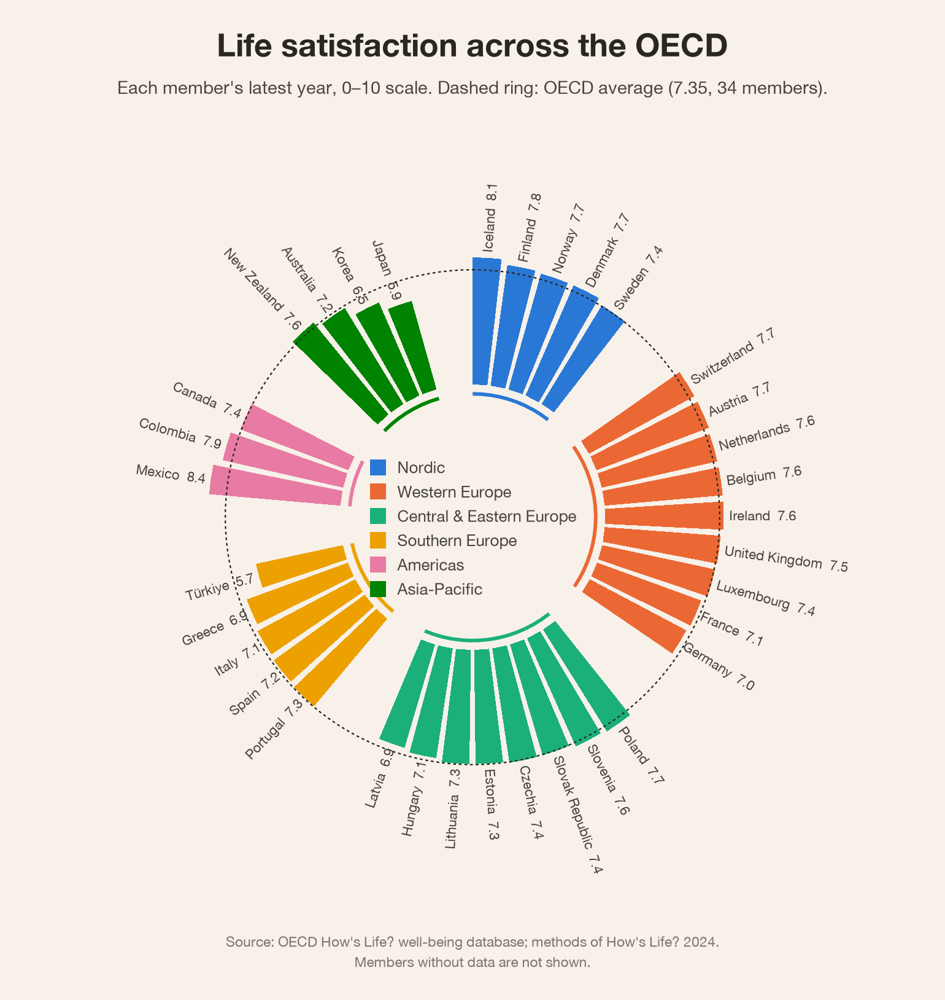

# R charts

Two ggplot2 charts drawn from the same How's Life? data the server uses, after examples in the
[R Graph Gallery](https://r-graph-gallery.com). The data comes from wise_mcp's own analysis,
so it follows the How's Life? 2024 method: OECD members only, national totals, each value with
its year.

| Chart | Script | Output |
|---|---|---|
| Life satisfaction across the OECD, as a circular barplot grouped by region | `circular_barplot.R` | `output/life_satisfaction_circular.png` |
| Household income vs life expectancy, 2004-2023, animated | `animated_bubbles.R` | `output/income_life_expectancy.gif` |

Each chart is drawn twice, for light and dark backgrounds (`*_dark`). The circular barplot also
has a title-free `*_card` version.




## Run

```bash
uv run python r/export_data.py   # refresh r/data/ from the local How's Life? cache
Rscript r/circular_barplot.R
Rscript r/animated_bubbles.R     # needs the gifski command-line tool: brew install gifski
```

R packages: `dplyr`, `tidyr`, `readr`, `ggplot2`, `scales` and `tweenr`. PNGs are saved with
R's built-in Cairo device.

## Notes

- **Regions** (`regions.R`) are a grouping for these charts, not an OECD classification.
- **The OECD average** in the circular barplot is a simple mean over the members with data,
  as How's Life? computes it.
- **The animation** interpolates each country between years with `tweenr`, the engine behind
  gganimate, and draws one ggplot per frame. gganimate itself needs `transformr`, which pulls in
  the spatial stack (sf, GDAL, PROJ) for nothing this chart uses.
- **Income** is in current US dollars at purchasing power parity, not adjusted for inflation.
- **Colours** are a categorical palette checked for colour-blind separation on both backgrounds.
