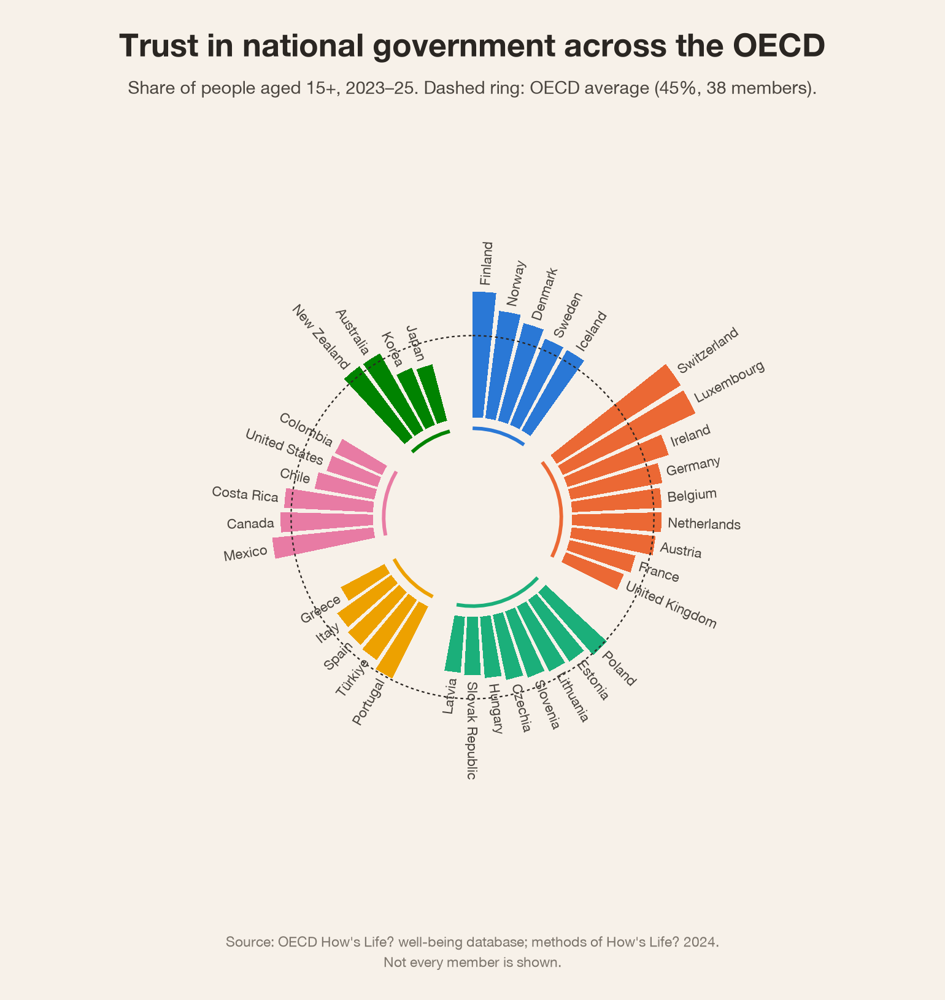
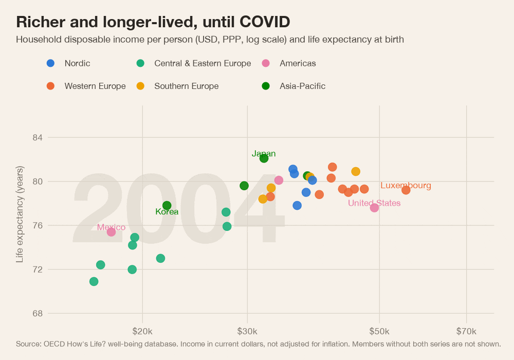

# R charts

Two ggplot2 charts drawn from the same How's Life? data the server uses, after examples in the
[R Graph Gallery](https://r-graph-gallery.com), each also made interactive. The data comes from
wise_mcp's own analysis, so it follows the How's Life? 2024 method: OECD members only,
national totals, each value with its year.

| Chart | Script | Output |
|---|---|---|
| Trust in national government, a circular barplot grouped by region | `circular_barplot.R` | `output/trust_government_circular.png`, interactive `.html` (ggiraph) |
| Household income vs life expectancy, 2004-2023, animated | `animated_bubbles.R` | `output/income_life_expectancy.gif` |
| The same, interactive: play, slider, hover | `interactive_bubbles.R` | `output/income_life_expectancy.html` (plotly) |

Every output has a dark-background twin (`*_dark`). The circular barplot also has a `*_card`
version for the website: interactive, 16:10, with a region legend in place of the country labels.





## Run

```bash
uv run python r/export_data.py    # refresh r/data/ from the local How's Life? cache
Rscript r/circular_barplot.R
Rscript r/animated_bubbles.R      # needs the gifski command-line tool: brew install gifski
Rscript r/interactive_bubbles.R
```

R packages: `dplyr`, `tidyr`, `readr`, `ggplot2`, `scales`, `tweenr`, `ggiraph`, `gdtools`,
`plotly` and `htmlwidgets`. Saving the interactive charts as single files needs pandoc
(`brew install pandoc`). PNGs use R's built-in Cairo device.

## Notes

- **Regions** (`regions.R`) are a grouping for these charts, not an OECD classification.
- **The OECD average** is the one How's Life? reports: a simple mean over every member with
  data (`data/oecd_averages.csv`).
- **The GIF** interpolates each country between years with `tweenr`, the engine behind
  gganimate, and draws one ggplot per frame. gganimate itself needs `transformr`, which pulls in
  the spatial stack (sf, GDAL, PROJ) for nothing this chart uses.
- **File sizes:** the ggiraph chart uses a system font (Helvetica, which Windows maps to Arial)
  rather than embedding fonts, and the plotly chart uses plotly's smaller "basic" bundle.
- **Income** is in current US dollars at purchasing power parity, not adjusted for inflation.
- **Colours** are a categorical palette checked for colour-blind separation on both backgrounds.
